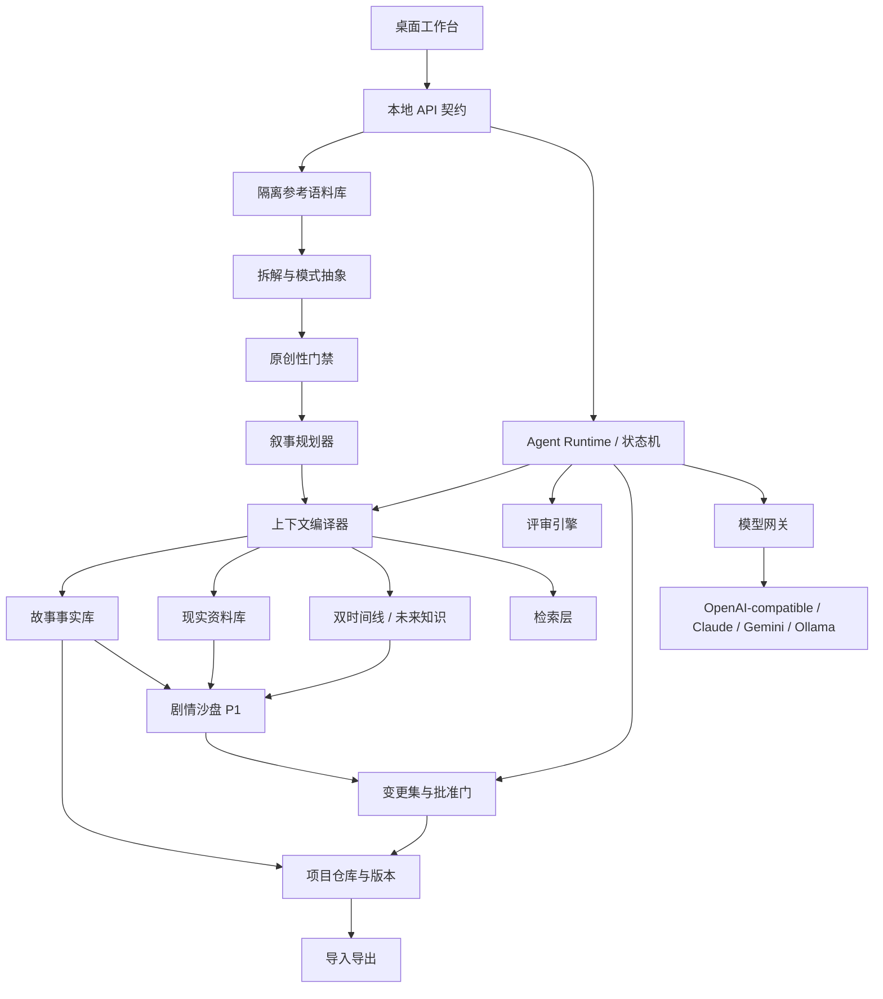

# 中文小说工作台开发计划

> 对应 PRD：中文小说工作台 PRD v0.6
> 计划版本：v0.6  
> 日期：2026-08-09  
> 估算前提：2–3 名工程师，产品/设计、题材研究与 QA 为兼职投入

> 已确认定位：中文男频网文优先；首发题材为历史重生和都市重生。拆书实验室从 MVP 起支持多书分段参考；P1 继续加深高级相似度，剧情沙盘另需约 4–6 周。

> 治理说明：本文件保留早期 M0–M6 规划和历史快照。当前实施范围、顺序与验收以根目录 PLAN.md 为准；实时进度以 PROGRESS.md 为准；真实能力状态见 capability-status.md。

## 0. 当前实施快照（2026-08-09）

已完成的 M0/M1 以及当前 M2 安全垂直切片：

- pnpm monorepo、React 工作台、FastAPI 本地服务、SQLite 仓库与 Tauri 2 桌面壳。
- 历史重生/都市重生项目创建、作品书架、已有作品重新打开、章节编辑、700ms 串行自动保存、导航前强制落盘与乐观 revision 门禁。
- 可持久化的读者承诺、开篇钩子、章节状态变化、情绪回报和章尾悬念；核心章纲未完成或未保存时禁止准备生成上下文。
- 可恢复的假模型状态机、上下文预览、候选稿隔离与作者明确采用。
- 旧数据库增量补列迁移、Tauri 生产 Web 构建模式和受限桌面来源 CORS/CSP。
- 未来三章滚动窗口、连续新增与切换章节、章节标题编辑，以及 `待写 → 草稿 → 审校中 → 已定稿` 状态机。
- 定稿锁定、显式重新打开、章节状态事件日志、末章序号门禁和状态 revision 门禁。
- 定稿后候选事实提取、逐项勾选、确认/拒绝门禁；只有作者确认的项目才进入正式事实。
- 原始时间线人工录入、小说时间线由确认后的状态变化落轨，两个层次独立存储和显示。
- 未来知识账本：年份、来源、置信度与有效状态；小说分歧只产生候选失效，作者确认后才改变有效性。
- 人物/资源账本：类型、定位、欲望或用途、当前状态、关系备注和乐观 revision 更新。
- 伏笔账本：人工埋设、已确认开放线索自动入账、来源章节，以及回收、放弃、重新打开状态流转。
- 连续三章节奏矩阵：并列显示读者承诺、开篇钩子、状态变化、情绪回报和章尾悬念，并提示重复节拍。
- 现实资料卡：史料、新闻、行业资料与个人笔记分类，记录来源、适用年代、可信度和作者确认状态。
- 确定性连续性检查与断更恢复卡：按来源汇总进度、下一章入口、开放伏笔、人物/资源状态、待处理审核与连续性风险。
- OpenAI Responses API 首个真实模型适配器：结构化本章章纲、完整章节候选、模型来源记录、内存/环境变量密钥配置和统一作者批准门。
- 安全上下文编译：真实模型只读取近期正文、正式事实、有效未来知识、开放伏笔和已确认现实资料，未确认资料不会进入提示词。
- 独立多书分段拆书库：TXT/Markdown 隔离导入、默认 50 万字章节感知区段、约 5 万字内部 Map、跨书六维 Reduce、模式卡持久化、来源回链、外部发送确认和原创性风险候选。
- 作品应用蓝图：作者选择模式卡维度并确认原创改编后应用到当前作品；章节 AI 只读取已应用的摘要、可迁移逻辑和作者备注，不能读取参考原文或未应用卡。
- 前后端 lint、严格类型检查、69 项后端测试、26 项前端交互测试、2 项 Rust 测试、生产构建、高危依赖审计与真实浏览器交互验收。

Tauri Rust 依赖、锁文件、桌面图标、`cargo check` 与无安装包 release 构建已在 2026-08-09 验证通过，`index.crates.io` 的 SSL 下载故障未复现。真实浏览器已进一步验证旧项目迁移、AI 配置状态、AI 共创入口、章纲门禁、新增章节、断更恢复卡和刷新恢复，控制台无警告或错误。真实模型调用因未提供正式 API Key 未做付费冒烟；自动化契约使用注入式网关验证成功、失败和密钥脱敏路径。

### 0.1 连续推进约定

- 产品负责人已授权按本计划连续推进，不在常规切片、里程碑或 schema 增量之间重复请求确认。
- 每个切片仍必须满足：领域约束、数据库迁移、API、界面、自动化测试、生产构建、桌面检查和真实交互验收形成闭环。
- 只有以下情况暂停并请求决策：改变本地优先/作者批准门/参考原文隔离原则；需要付费账号或外部发布权限；引入高风险许可证；执行不可逆数据操作；两个合理方案会实质改变产品定位。
- 普通技术选择、可逆界面调整、增量数据表和测试补强由开发代理基于 PRD 自主决定，并在里程碑记录中说明。

### 0.2 完整度路线

| 阶段 | 产品结果 | 当前状态 | 完成定义 |
|---|---|---|---|
| M0 工程底座 | 本地服务、Web、桌面壳、统一验证 | 已完成 | 全量校验和桌面 release 构建通过 |
| M1 写作内核 | 从建书、章纲、正文到定稿和事实回灌 | 已完成 | 冷启动可恢复，AI 候选不能越过作者批准门 |
| M2 连载控制 | 人物/资源/伏笔、双时间线、未来知识、滚动规划 | 进行中 | 连续 10 章的事实、伏笔和未来知识状态同步 |
| M3 素材与拆书 | 合法资料导入、来源回链、模式卡、原创性门禁 | 进行中 | 参考原文与生成上下文隔离，高风险方案被阻断 |
| M4 智能代理 | 导演、资料、连续性、节奏、文风、记录员编排 | 提前启动 | 可恢复、可重放、可追踪、可限额 |
| M5 产品化 | 导入导出、备份恢复、模型设置、安装包 | 未开始 | 干净机器安装与恢复演练通过 |
| M6 封闭测试 | 压测、安全、许可证和作者试用 | 未开始 | 达到 PRD 发布门槛 |

## 1. 交付策略

开发采用“可运行垂直切片”推进。第一条切片不是先做完整编辑器或完整知识库，而是尽快跑通：

> 创建重生项目 → 建立现实资料与原始时间线 → 设置重生分歧点和未来知识 → 建立未来 3–5 章滚动章纲 → 编译上下文 → 生成本章 → 七维审校 → 作者批准 → 更新小说时间线与候选事实 → 更新存稿和下一章入口 → 重启后恢复

后续功能都在这条闭环上加深，避免形成一批彼此孤立的页面和 Agent。

第二条风险优先切片在真实模型接通后立即完成：

> 导入多部合法参考小说 → 每部按默认 50 万字并优先在章节边界形成分析区段 → 区段内部再分块提取带来源的结构、钩子、人物功能与节奏 → 抽象为模式卡 → 跨书选择并融合 → 为各维度选择保留/调整/重构并重新组合人物关系 → 运行单项与组合风险门禁 → 通过后进入叙事规划器

MVP 不做“按某书一键仿写”。参考原文与新作生成上下文物理/逻辑隔离；多书模式融合进入 MVP，自动权重学习和场景级语义相似度在 P1 加深。

## 2. 技术规格

### 2.1 技术栈

| 层 | 选择 | 说明 |
|---|---|---|
| 桌面 | Tauri 2.x | macOS/Windows 本地工作台和系统能力 |
| UI | React 19.2 + TypeScript 5.x + Vite | 编辑器和工作台界面 |
| 本地服务 | Python 3.14 + FastAPI | Agent、模型适配、导入导出和后台任务 |
| 数据 | SQLite + 迁移工具 | 结构化故事状态、运行状态和索引 |
| 正文 | UTF-8 本地文件 + 数据库索引 | 可读、可备份、便于版本控制 |
| 检索 | P0 关键词/元数据；P1 可插拔向量索引 | 结构化事实优先于语义召回 |
| 资料解析 | 本地 TXT、Markdown、PDF 解析 | 现实资料与参考作品使用隔离的存储类型和索引 |
| 测试 | Vitest、React Testing Library、Pytest、Playwright | 单元、集成、端到端与桌面冒烟 |
| 密钥 | macOS Keychain / Windows Credential Manager | 不在项目文件保存明文密钥 |

具体依赖在脚手架阶段锁定精确版本并提交 lockfile；只采用当时仍受支持的版本。

### 2.2 建议命令

以下是目标命令接口，脚手架完成后必须保持稳定：

```bash
# 安装全部开发依赖
pnpm install
pnpm run backend:sync

# 开发
pnpm run dev
pnpm run desktop:dev

# 静态检查
pnpm run lint
pnpm run typecheck
pnpm run format:check

# 测试
pnpm run test
pnpm run test:backend
pnpm run test:integration
pnpm run test:e2e

# 构建与打包
pnpm run build
pnpm run desktop:build

# 全量验证
pnpm run verify
```

### 2.3 建议项目结构

```text
apps/
  desktop/              Tauri 桌面壳与安装配置
  web/                  React 工作台
services/
  agent-runtime/        Python 本地服务、任务和模型适配
  reference-engine/     参考作品切分、抽象模式与原创性门禁
packages/
  contracts/            前后端共享 schema 与 API 契约
  ui/                   通用 UI 组件和设计 token
  editor/               中文正文编辑器能力
  test-fixtures/         固定测试项目和假模型响应
docs/
  product/              PRD、用户流程和验收记录
  architecture/         架构说明和 ADR
  evals/                中文质量评测规范
tests/
  integration/          跨模块闭环测试
  e2e/                  用户端到端流程
tools/                  构建、打包、迁移和许可证检查
```

### 2.4 代码风格

- TypeScript 使用严格模式；公共接口使用明确类型，不在领域模型中传播 `any`。
- Python 使用类型标注；外部输入先经过 schema 校验再进入领域逻辑。
- 领域命名使用稳定的英文代码词汇，并在产品文档维护中文对照，例如 `CanonFact（正式事实）`、`ChangeSet（变更集）`。
- 状态转换通过命令接口发生，不允许 UI 直接修改数据库状态。

```ts
type ApproveChapterCommand = {
  projectId: string;
  chapterId: string;
  draftVersionId: string;
  expectedRevision: number;
};

type ApproveChapterResult = {
  approvedVersionId: string;
  candidateFactChangeSetId: string;
};
```

以上示例表达两项约束：批准操作显式绑定草稿版本；并发或过期操作通过 `expectedRevision` 被拒绝，而不是静默覆盖。

### 2.5 开发边界

**始终执行**

- 先更新 PRD/ADR，再改变核心领域状态或公开接口。
- 所有任务都包含验收条件和验证命令。
- 保存、恢复、迁移和密钥相关改动必须有自动化测试。
- AI 结构化输出必须校验；失败时保留原始响应和安全错误信息。
- 每次发布运行许可证、密钥泄露和安装包冒烟检查。
- 参考作品分析必须保留来源回链；测试语料只能使用作者自有、明确授权、公版或合成文本。

**暂停并确认**

- 改变本地优先、BYOK、作者批准门或参考原文隔离原则。
- 新增需要付费账号、云端常驻服务、大型模型文件或外部发布权限的依赖。
- 引入 AGPL、SSPL、Commons Clause 或无明确许可证的代码。
- 添加会上传稿件、遥测或错误报告的网络功能。
- 执行不可逆的数据删除、迁移降级或用户作品覆盖。

**绝不执行**

- 将 API 密钥、真实用户稿件或未经脱敏日志提交到仓库。
- 让模型响应直接执行系统命令、修改正式事实或覆盖已批准正文。
- 为通过测试而删除失败测试、降低数据安全断言或隐藏迁移错误。
- 复制许可证不明确项目的代码、提示词或品牌资产。
- 破解 DRM、绕过付费、批量抓取参考小说，或让参考原文默认进入正文生成上下文。

## 3. 总体架构与依赖



关键依赖顺序：

1. API 契约、项目仓库和状态机骨架必须先于真实 Agent。
2. 正式事实库必须先于上下文编译器的完整实现。
3. 现实资料类型和双时间线必须先于历史/都市重生的上下文与现实锚点审校。
4. 上下文编译器和模型网关必须先于正文作者与评审 Agent。
5. 变更集与批准门必须先于自动事实回灌。
6. 参考语料隔离和最低原创性门禁必须先于任何参考驱动的新作生成；正文 Agent 不得直接查询参考原文索引。
7. 闭环可靠后才能加入剧情沙盘、批量章节、向量检索和更多提供商。

## 4. 里程碑计划

### M0：规格、脚手架与风险试验（第 1 周）

**目标**：形成可构建、可测试、可打包的空应用，并关闭三个高风险技术问题。

交付物：

- PRD v1、领域词汇表、状态机 ADR、存储 ADR 和许可证策略。
- 网文领域词汇：读者承诺、章节状态变化、情绪回报、章尾悬念、开放线索、滚动章纲和安全存稿量。
- 重生题材领域词汇：现实锚点、原始时间线、小说时间线、重生点、分歧事件、未来知识、候选失效和沙盘假设。
- 事实分层 ADR：现实资料、历史争议、作者设定、小说事实和模拟假设的类型边界。
- 参考作品 ADR：`ReferenceEvidence`、`AbstractPattern`、`GeneratedBlueprint`、`SimilarityFinding` 与正式故事事实的隔离边界，以及外部模型片段预览策略。
- 合法测试语料方案：合成参考小说、近似变体和无关对照文本，不把未授权商业小说提交到仓库或 CI。
- Tauri + React + FastAPI sidecar 脚手架。
- 前后端契约生成或校验机制。
- SQLite 迁移、日志脱敏和系统密钥存储 spike。
- macOS/Windows sidecar 打包 spike。
- 中文编辑器 30 万字符性能 spike。

退出条件：

- 两个平台至少完成一次开发构建；CI 能运行 lint、类型检查和单元测试。
- 明确正文主存储、sidecar 生命周期和密钥存储方案。
- 未解决的阻断风险有负责人和截止时间。

### M1：最小章节闭环（第 2–3 周）

**目标**：使用假模型跑通第一个可恢复的垂直切片。

交付物：

- 新建项目、卷章树和基础正文编辑器。
- 网文项目设置：题材、目标读者、章节目标字数、更新频率和安全存稿量。
- 重生项目设置：重生年代、地点、原始时间线入口和首个分歧点。
- 最简连载看板：今日目标、章节状态和未来三章入口。
- 项目仓库、自动保存和章节快照。
- 章节状态机与事件日志。
- 最简章纲、上下文包和假模型流式输出。
- 最简连续性与连载节奏问题列表、批准操作和候选事实变更集。
- 应用重启后恢复中断任务。

退出条件：

- 端到端测试完成“建书到事实回灌”闭环。
- 首个测试项目能连续完成三章，并在每章批准后推进下一章入口和存稿状态。
- 在生成、审校、回灌三个阶段强制退出应用后均能恢复。
- 重复恢复不产生重复事实或覆盖批准文本。

### M2：现实资料、双时间线与多级规划（第 4–6 周）

**目标**：建立长篇连续性的结构化基础。

交付物：

- 人物、关系、地点、组织、物品、世界规则、时间线和伏笔模型。
- TXT、Markdown、PDF 资料导入与资料卡：来源、日期、适用年代、摘录、可信度和确认状态。
- 原始时间线、小说时间线、重生点、分歧事件和影响关系。
- 主角未来知识账本：内容、来源、置信度、有效状态和候选失效。
- 草案、候选、正式三态事实以及来源追踪。
- 书纲、卷纲、章纲、场景四级规划。
- 近 3–5 章细化、远期卷级留白的滚动规划，以及承诺、升级、兑现和章尾悬念字段。
- 锁定字段、局部重新生成和规划变更影响提示。
- 已有 Markdown/TXT 项目导入。

退出条件：

- 可以从测试稿件提取候选事实并经人工确认进入正式库。
- 时间状态变化与历史事实可同时存在，不互相覆盖。
- 规划局部重生成不会修改锁定内容。
- 推进一章后，滚动窗口能保留锁定决策并生成新的远端章纲候选。
- 现实资料、作者设定、小说事实和 AI 推演假设在存储与 UI 中保持可辨认。
- 分歧事件发生后能生成未来知识候选失效清单，但不自动删除或改写。

### M3：模型网关与八 Agent 流程（第 7–8 周）

**目标**：用真实模型完成稳定、可追踪的章节生产。

首发 Agent：

1. 资料研究员：把作者导入的现实材料整理为资料卡，标记年代、来源和不确定性。
2. 总导演：故事定位、重生分歧和规划建议。
3. 正文作者：生成、续写和局部改写。
4. 连续性编辑：事实、双时间线、称谓和人物知识检查。
5. 连载节奏编辑：检查章节状态变化、情绪回报、承诺兑现和章尾悬念，并观察连续三章分布。
6. 中文文风编辑：套话、重复、翻译腔、叙述距离和格式检查。
7. 事实记录员：从批准正文形成候选变更集和时间线变化。
8. 拆书分析师：只在隔离参考语料库中提取结构、钩子、人物功能和节奏证据，并输出可校验的抽象模式卡。

交付物：

- OpenAI-compatible 模型适配器、流式输出、取消、超时和重试。
- Agent 模板版本管理和结构化输出校验。
- 按 Agent 选择模型、使用量与费用记录。
- 八 Agent 编排、失败恢复和单维度重跑。
- 上下文来源查看器。

退出条件：

- 同一契约套件同时通过假模型和至少两个 OpenAI-compatible 端点。
- 任何 Agent 响应不合 schema 时不会污染项目状态。
- 用户可在失败后换模型重试，且保留原任务目标与上下文版本。

### M3-R：拆书实验室与最低原创性门禁（第 9–10 周）

**目标**：跑通“参考作品分析—抽象模式—原创方案—风险门禁”的最小安全链路，不提供一键仿写。

交付物：

- 参考作品隔离语料库与本地 TXT、Markdown、PDF 导入；与现实资料、作者稿件和正式事实使用不同类型与索引。支持多书并存，超长作品默认每 50 万字形成分析区段，区段内部再分块调用模型。
- 卷、章、场景和视角候选切分，以及作者修正入口。
- 故事发动机、前三章钩子、章尾悬念、承诺—升级—兑现节奏、情绪曲线、人物功能与关键节拍提取。
- 分析结论到来源章节的回链；证据层允许短摘录，抽象模式卡不得携带长段原文。
- 模式卡选择策略：时代、核心欲望、冲突因果、资源体系、关键场景顺序和结局分别支持保留、调整或重构；人物关系默认建议重新组合，但不以固定变更数量作为机械门槛。
- 最低原创性门禁：检查长短语重合、专名碰撞、人物组合、关键节拍序列和多维度组合风险；高风险结果不能直接进入规划器。
- 参考原文删除、派生索引清理和外部模型调用片段预览。

退出条件：

- 使用合成语料完成端到端演示；每条分析结论可返回来源章节，模式卡与正式故事事实不混型。
- 正文 Agent 无法通过 API 或检索接口读取参考原文，只能读取作者选择的模式卡和已通过门禁的新作方案。
- 故意复制专名、人物组合、关键节拍序列或长短语的测试方案全部被阻断。
- 删除参考作品后，原文、缓存和派生索引均不可检索；用户选择保留的抽象模式卡仍可独立使用。

### M4：上下文编译器与重生题材评测（第 11–12 周）

**目标**：让长篇上下文选择可解释、可测量，并降低连续性问题。

交付物：

- token/字符预算、硬约束优先级和参与人物过滤。
- 章节摘要、开放线索、来源证据和历史片段召回。
- 中文事实冲突、称谓、知识泄漏、年代错置、双时间线、未来知识失效、章节推进、情绪兑现、章尾悬念和文风测试集。
- 现实资料引用、适用年代和事实类型隔离检查。
- 单章与连续三章两种节奏评审窗口，避免每章使用完全相同的钩子和兑现模式。
- 规则检查与 LLM 检查合并、去重和严重级别排序。
- 向量检索技术 spike；达标后才进入 P1，否则继续关键词与元数据召回。

退出条件：

- 固定输入得到稳定排序的上下文包，并能解释每段资料的入选原因。
- 连续性测试集召回率达到 90%，误报率不高于 20%。
- 连载节奏测试集对无有效变化、长期未兑现和失效悬念的召回率达到 85%。
- 重生题材测试集对年代错置、分歧后因果冲突和已失效未来知识的召回率达到 90%。
- 30 万中文字符项目的搜索和上下文准备满足性能目标。

### M5：版本、导出与产品化体验（第 13–14 周）

**目标**：让作者可以日常使用、比较版本和取回作品。

交付物：

- 局部改写、锁定片段、正文差异和章节分支。
- Markdown 导出；DOCX/EPUB 根据 PRD 评审结果选择进入 MVP 或 P1。
- 任务中心、错误恢复引导、成本面板和键盘操作。
- 连载看板：今日目标、连续更新记录、存稿状态、未来 3–5 章滚动章纲和复更恢复卡。
- 重生看板：原始/小说双时间线、当前分歧、未来知识状态和待核实资料。
- 拆书实验室：参考章节树、结构/钩子/节奏视图、来源证据、模式卡和原创性报告。
- 项目备份、恢复和迁移工具。
- 基础新手引导与示例项目。

退出条件：

- 已批准章节可以准确导出且重新导入不丢失层级和正文。
- 备份恢复演练通过，损坏项目能被检测并阻止继续写入。
- 核心流程可使用键盘完成。

### M6：硬化、打包与封闭测试（第 15–18 周）

**目标**：达到可交付给首批作者测试的质量。

交付物：

- macOS/Windows 安装包、签名、升级和卸载流程。
- 全量端到端、长时运行、崩溃恢复和 30 万字压力测试。
- 安全审查：密钥、日志、导入解析、外部网络和提示注入边界。
- 第三方依赖 SBOM、许可证清单和 NOTICE。
- 10–20 名男频网文作者封闭测试，其中历史重生和都市重生作者各不少于 5 名。

退出条件：

- PRD 发布门槛全部通过。
- 无数据丢失、密钥泄露或无法恢复的阻断缺陷。
- 至少 80% 封闭测试用户能独立完成首章闭环。
- 固定测试项目能连续完成 10 章，且开放承诺、正式事实和滚动章纲保持同步。
- 两个重生题材项目均能维护原始时间线、小说时间线和未来知识失效状态。
- 参考作品导入、删除、隔离和原创性门禁满足 PRD 发布门槛。

### P1-R：多书融合与高级原创性分析（MVP 发布后 3–4 周）

**目标**：把单书拆解升级为 2–5 部参考作品的比较研究，并增强场景级原创性判断。

交付物：

- 2–5 部作品的共同模式、差异和题材惯例对比。
- 多参考模式融合、来源权重和相互冲突提示。
- 场景级语义相似度、情节图相似度和可配置阈值；结果只作为风险提示与门禁证据，不输出“侵权/不侵权”法律结论。
- 文风仅提取可组合维度，如句长、对话比例、视角、信息密度和节奏，不提供“复刻某在世作者”的模式。
- EPUB、DOCX 参考作品导入，以及分析报告导出。

退出条件：

- 合成多书基准能区分题材共性、单书特征和刻意近似场景。
- 融合方案记录每个维度的保留、调整或重构状态，并保留每张模式卡的来源谱系；最终组合必须通过门禁，而不是依靠固定“至少改变几项”的规则。
- 高风险语义近似结果不能绕过门禁直接进入正文生成。

### P1-S：剧情沙盘（MVP 发布后 4–6 周）

**目标**：独立实现受 MiroFish 启发、但面向小说行动模型的角色与势力推演，不引入 MiroFish 源码、AGPL 依赖、Zep Cloud 或 Twitter/Reddit 动作模型。

交付物：

- 从正式事实、现实资料和双时间线创建不可变场景快照。
- 5–20 个关键角色或势力、3–10 轮、明确费用上限的推演任务。
- 小说行动模型：感知、判断、对话、隐瞒、调查、合作、对抗、资源变化和关系变化。
- 动态注入“如果……”事件，并对比至少三条剧情分支。
- 角色采访、势力反应、意外后果、设定冲突和剧情影响报告。
- 沙盘输出只进入候选章纲或候选事实变更集，由作者批准。

退出条件：

- 固定历史重生和都市重生场景各完成至少 20 次可重复评测。
- 每个结论能追溯到场景快照、角色状态或明确的推演假设。
- 沙盘无法直接修改正式正文、事实或时间线。
- 费用、轮数和角色上限均可在运行前查看和控制。

## 5. 可并行与必须串行的工作

### 可并行

- UI 设计系统与后端项目仓库契约。
- 中文质量测试集与模型网关开发。
- 连载看板 UI 与滚动规划领域逻辑。
- 现实资料解析器与双时间线领域模型。
- 参考作品切分/来源回链与原创性规则检测器；两者可按契约并行，集成前不得开放参考驱动生成。
- 导出 spike 与上下文编译器实现。
- macOS/Windows 打包验证。
- 用户示例项目与自动化测试夹具。

### 必须串行

- 数据 schema → 项目仓库 → 状态机 → Agent Runtime。
- 故事事实库 → 上下文编译器 → 连续性评审。
- 现实资料库 → 双时间线 → 未来知识检查 → 重生题材评审。
- 隔离参考语料库 → 结构拆解 → 模式抽象 → 选择性保留/调整/重构 → 人物关系重组 → 原创性门禁 → 叙事规划器。
- 章节批准 → 候选事实变更集 → 正式事实回灌。
- 假模型闭环 → 真实模型接入 → 多提供商契约测试。
- 备份格式冻结 → 迁移工具 → 公开测试。

## 6. 任务清单

每个任务应在一个专注开发会话内完成；实际实施时再绑定精确文件列表。

### Epic A：工程基础

- [ ] 建立 monorepo、锁定运行时与统一验证命令。  
  **验收**：新环境能一条命令安装并运行桌面开发版。  
  **验证**：执行 `pnpm run verify` 和 `pnpm run desktop:dev`。
- [ ] 定义前后端 API 契约和错误模型。  
  **验收**：无效请求、冲突、取消、超时和内部错误有稳定表示。  
  **验证**：契约测试与类型生成检查通过。
- [ ] 建立 SQLite 迁移与测试数据库。  
  **验收**：可从空库升级、回放迁移并检测版本不兼容。  
  **验证**：迁移测试通过。
- [ ] 建立脱敏日志和系统密钥存储。  
  **验收**：日志和诊断包不包含测试密钥。  
  **验证**：密钥扫描测试通过。

### Epic B：项目与编辑器

- [x] 实现项目创建、打开、关闭和最近项目列表。  
  **验收**：重启后可重新打开项目。  
  **验证**：项目生命周期端到端测试。
- [ ] 实现卷章场景树与排序。  
  **验收**：新增、重命名、移动和删除均可撤销。  
  **验证**：树结构集成测试。
- [ ] 实现中文正文编辑、字数统计和自动保存。  
  **验收**：30 万字符测试项目编辑无明显阻塞。  
  **验证**：性能基准和保存恢复测试。
- [ ] 实现快照、差异和回滚。  
  **验收**：回滚产生新版本，不销毁历史。  
  **验证**：版本行为测试。
- [ ] 实现连载目标、章节状态和存稿看板。  
  **验收**：今日目标、已写字数、草稿、待审、批准和可发布状态计算正确。  
  **验证**：连载看板行为与日期边界测试。

### Epic C：故事事实与规划

- [ ] 实现统一实体、关系、事实、来源和有效期模型。  
  **验收**：支持历史状态与当前状态并存。  
  **验证**：领域单元测试。
- [ ] 实现人物、世界、时间线和伏笔界面。  
  **验收**：作者可创建、编辑、筛选并查看来源。  
  **验证**：UI 集成测试。
- [ ] 实现草案、候选、正式事实状态转换。  
  **验收**：只有显式批准能产生正式事实。  
  **验证**：权限与状态转换测试。
- [ ] 实现本地现实资料卡和 PDF/TXT/Markdown 导入。  
  **验收**：每张资料卡包含来源、日期、适用年代、摘录、可信度和确认状态。  
  **验证**：解析、编码、来源保留和恶意文件测试。
- [x] 实现原始时间线与小说时间线。  
  **验收**：重生点、分歧事件和后续事件能分别显示，原始时间线保持只读。  
  **验证**：双时间线领域与 UI 集成测试。
- [x] 实现未来知识账本和候选失效传播。  
  **验收**：重大分歧后只生成候选失效，不自动删除知识；作者可以确认、拒绝或修正。  
  **验证**：分歧传播和批准门测试。
- [ ] 实现卷级方向、滚动章纲和场景节拍。  
  **验收**：父级结构可查看子级覆盖与未完成项，未来 3–5 章可细化且远期方向保持可调整。  
  **验证**：规划层级测试。
- [x] 实现章节承诺、状态变化、情绪回报和章尾悬念字段。  
  **验收**：连续三章可显示承诺、升级、兑现和悬念分布。  
  **验证**：节奏窗口领域测试。
- [x] 实现断更恢复卡。  
  **验收**：恢复卡包含上次进度、开放线索、角色当前状态和下一章入口，且每项均有来源。  
  **验证**：固定项目恢复卡快照测试。
- [ ] 实现字段锁定和局部重新生成协议。  
  **验收**：重生成不会改变锁定字段。  
  **验证**：合并与冲突测试。

### Epic D：Agent Runtime 与模型

- [ ] 实现持久化章节状态机和事件日志。  
  **验收**：每次状态转换可追踪、可重放。  
  **验证**：状态机模型测试。
- [ ] 实现暂停、取消、重试和恢复。  
  **验收**：三个关键阶段崩溃后恢复不产生重复副作用。  
  **验证**：故障注入集成测试。
- [ ] 实现假模型和响应录制回放。  
  **验收**：默认测试不访问网络。  
  **验证**：离线全量测试。
- [x] 实现 OpenAI Responses API 首个适配器与安全配置。  
  **验收**：结构化章纲和完整章节均先形成候选；运行记录包含提供商/模型；密钥只来自环境变量或进程内存且不回显。  
  **验证**：候选采用门禁、提供商失败、运行恢复和密钥脱敏测试。
- [ ] 完成 OpenAI-compatible 多提供商适配器。  
  **验收**：流式、取消、超时、用量与结构化输出通过契约套件。  
  **验证**：提供商契约测试。
- [ ] 实现 Agent 模板、版本和运行记录。  
  **验收**：每个输出可追溯到模型、模板和上下文版本。  
  **验证**：追踪完整性测试。
- [ ] 实现资料研究员 Agent。  
  **验收**：只能基于导入材料生成资料卡；推断和争议信息必须显式标记，不能伪造来源。  
  **验证**：无来源、冲突来源和错误年代测试。

### Epic E：上下文与评审

- [ ] 实现上下文包 schema 和预算器。  
  **验收**：硬约束不会因预算不足被静默移除。  
  **验证**：边界与预算测试。
- [ ] 实现参与人物、规则、时间线和开放伏笔选择。  
  **验收**：无关人物不会默认进入章节上下文。  
  **验证**：固定项目检索测试。
- [ ] 实现章节摘要和历史原文召回。  
  **验收**：所有召回片段包含来源和入选原因。  
  **验证**：召回可解释性测试。
- [ ] 实现七维评审结构和问题合并。  
  **验收**：问题包含严重级别、证据、解释、建议和置信度。  
  **验证**：schema 与去重测试。
- [ ] 实现单章与连续三章连载节奏评审。  
  **验收**：能识别无有效变化、承诺长期不兑现、悬念失效和连续钩子同质化。  
  **验证**：连载节奏黄金测试集。
- [ ] 建立中文质量黄金测试集。  
  **验收**：覆盖事实冲突、称谓、知识泄漏、年代错置、双时间线、未来知识失效、章节推进、情绪兑现、悬念、套话和标点。  
  **验证**：评测脚本生成稳定报告。

### Epic F：批准、回灌与导出

- [ ] 实现正文建议变更集。  
  **验收**：支持接受、拒绝、部分接受和人工编辑。  
  **验证**：差异应用测试。
- [ ] 实现章节批准门和乐观并发检查。  
  **验收**：过期草稿不能覆盖较新批准版本。  
  **验证**：冲突测试。
- [ ] 实现候选事实提取与确认。  
  **验收**：模型无法直接写正式事实。  
  **验证**：完整回灌集成测试。
- [ ] 实现 Markdown 导出。  
  **验收**：卷章顺序、标题和中文编码准确。  
  **验证**：快照测试与重新导入测试。
- [ ] 实现项目备份和恢复。  
  **验收**：恢复后正文、事实、版本和运行记录一致。  
  **验证**：备份校验与损坏注入测试。

### Epic G：发布硬化

- [ ] 完成 macOS 与 Windows 安装包。  
  **验收**：全新机器无需额外运行时即可启动。  
  **验证**：干净虚拟机安装冒烟测试。
- [ ] 完成升级与卸载数据保留策略。  
  **验收**：升级不丢项目，卸载明确询问是否保留数据。  
  **验证**：版本升级矩阵测试。
- [ ] 完成安全和许可证审查。  
  **验收**：无高危问题，SBOM 与 NOTICE 完整。  
  **验证**：依赖扫描、密钥扫描和人工审查记录。
- [ ] 运行封闭测试并处理阻断问题。  
  **验收**：达到 PRD 发布门槛。  
  **验证**：发布检查清单签字。

### Epic H：P1 剧情沙盘

- [ ] 定义小说行动模型和场景快照契约。  
  **验收**：角色只能执行符合能力、位置、知识和资源约束的行动。  
  **验证**：非法行动、知识越权和快照不可变测试。
- [ ] 实现小规模多角色推演运行器。  
  **验收**：支持 5–20 个角色、3–10 轮、取消、恢复和预算限制。  
  **验证**：假模型集成和故障注入测试。
- [ ] 实现变量注入和多分支比较。  
  **验收**：相同快照可运行多个“如果”分支且互不污染。  
  **验证**：分支隔离测试。
- [ ] 实现角色采访和剧情影响报告。  
  **验收**：结论包含证据、假设、关系变化、意外后果和冲突提示。  
  **验证**：历史/都市重生固定场景评测。
- [ ] 接入候选章纲与批准门。  
  **验收**：沙盘结果未经作者选择不能进入正式项目状态。  
  **验证**：权限边界端到端测试。

### Epic I：拆书实验室与原创性防护

- [ ] 定义参考作品领域契约和隔离存储。  
  **验收**：`ReferenceEvidence`、`AbstractPattern`、`GeneratedBlueprint`、`SimilarityFinding` 与 `CanonFact` 无法通过类型或仓储接口混写。  
  **验证**：schema、仓储权限和错误类型测试。
- [ ] 实现 TXT、Markdown、PDF 参考作品导入与卷章场景切分。  
  **验收**：同一项目可导入多本书；300 万字作品默认形成 6 个连续分析区段；导入结果可人工修正，每个区段和场景保留文件、卷章和字符区间来源。  
  **验证**：编码、标题变体、大文件、恶意 PDF 和来源回链测试。
- [ ] 实现拆书分析师与抽象模式卡。  
  **验收**：输出覆盖故事发动机、钩子、兑现节奏、情绪曲线、人物功能和关键节拍；模式卡不含长段原文。  
  **验证**：合成语料黄金集、schema 和摘录长度测试。
- [ ] 实现模式选择、选择性重组和原创方案生成。  
  **验收**：方案记录选用模式与来源谱系；时代、欲望、因果、资源、场景顺序和结局可分别选择保留、调整或重构，并默认提示重新组合人物关系。  
  **验证**：维度选择、人物关系重组和生成链路集成测试。
- [ ] 实现最低原创性门禁。  
  **验收**：长短语、专名、人物组合或关键节拍序列达到高风险阈值时，方案只能修改、重生成或人工确认，不能一键进入正文生成。  
  **验证**：近似变体、无关对照、阈值边界和门禁权限测试。
- [ ] 实现参考原文删除与模型调用预览。  
  **验收**：删除后清理原文、缓存和派生索引；外部模型调用前列出将离开设备的片段。  
  **验证**：删除完整性、残留扫描和网络请求快照测试。
- [ ] 实现 P1 多书融合与场景级语义相似度。  
  **验收**：2–5 部来源可对比，融合方案保留来源谱系；语义高风险结果不能绕过门禁。  
  **验证**：多书合成基准和场景近似对抗测试。

## 7. 测试与评测计划

### 7.1 自动化测试目标

- 领域核心（事实、状态机、变更集、上下文预算）分支覆盖率不低于 90%。
- 普通 UI 与适配层不追求统一覆盖率数字，以关键用户行为和契约覆盖为准。
- 每个缺陷修复必须包含能复现问题的回归测试。
- 默认 CI 不调用付费模型；真实模型冒烟在显式、限额的发布流程运行。

### 7.2 固定评测项目

建立三个可公开或合成的小说项目，以及一个独立参考语料基准：

1. **历史重生，20 章**：重点测试史料来源、制度与技术约束、双时间线、未来知识失效和势力反应。
2. **都市重生，30 章**：重点测试年代事物、行业与商业逻辑、城市生活、未来知识边界和连载兑现。
3. **都市商战支线，15 章**：重点测试企业、媒体、消费者和监管等群体反应，为 P1 剧情沙盘提供固定场景。
4. **拆书与原创性基准**：两部合成同题材小说、一个刻意近似变体和一部无关对照作品；重点测试来源回链、抽象隔离、选择性保留、人物关系重组、组合风险、误报与漏报。

每个项目包含故意注入的矛盾、标准答案、允许的多解范围和人工评分记录。

### 7.3 发布验证矩阵

| 维度 | 最低范围 |
|---|---|
| 系统 | 当前两个受支持的 macOS 主版本、Windows 11 |
| 项目规模 | 1 章、30 章、100 章、30 万中文字符 |
| 模型 | 假模型、两个 OpenAI-compatible 端点 |
| 故障 | 超时、断网、限流、schema 错误、磁盘写入失败、应用退出 |
| 数据 | 新建、旧版本迁移、备份恢复、损坏检测 |
| 导入导出 | UTF-8 TXT、Markdown；DOCX/EPUB 若进入 MVP |
| 参考作品 | TXT、Markdown、PDF；删除残留、外部模型片段预览、近似与无关对照 |

## 8. 主要风险与缓解

| 风险 | 影响 | 缓解措施 |
|---|---|---|
| 长篇事实漂移 | 后续章节失真 | 结构化事实为准、来源追踪、批准门、黄金评测集 |
| 现实资料错误或年代错置 | 破坏题材可信度 | 来源、适用年代、可信度、争议标记和人工确认 |
| 分歧后仍照搬原时间线 | 重生逻辑失真 | 双时间线、未来知识候选失效和影响传播 |
| 沙盘结果显得权威但只是推演 | 作者误用假设 | 强制标记假设、证据与置信度，结果只进入候选分支 |
| “AI味”难以客观度量 | 审校不可信 | 规则 + LLM + 作者接受率，不用单一总分替代判断 |
| 节奏指标导致机械套路 | 章节同质化 | 指标只提示风险，不自动改稿；同时评估单章与三章差异，不设唯一高分模板 |
| Tauri + Python sidecar 打包复杂 | 延误跨平台发布 | 第 1 周完成双平台 spike；失败则降级为本地 Web UI |
| 向量索引跨平台兼容差 | 打包或检索不稳定 | P0 不依赖向量；接口隔离，P1 通过 spike 后接入 |
| 模型提供商差异大 | 任务行为不一致 | 统一能力探测和契约套件，按能力降级 |
| 用户成本不可控 | 影响留存 | 调用前估算、按 Agent 选模、限额、取消和重跑单维度 |
| 自动回灌污染事实库 | 长期不可逆错误 | 候选变更集 + 人工批准，不允许模型直接写正式事实 |
| 项目损坏或丢稿 | 灾难性影响 | 原子写入、快照、校验、备份恢复演练 |
| 密钥或稿件泄露 | 安全与信任风险 | 系统钥匙串、默认本地、网络白名单、日志脱敏 |
| 开源许可证污染 | 商业化受限 | 清洁实现、依赖清单、法律复核、禁止无许可证代码进入主干 |
| 参考作品被当作仿写底稿 | 产生版权与产品声誉风险 | 原文/模式/新作三层隔离、维度级保留/调整/重构、人物关系优先重组、组合风险门禁、禁止一键仿写 |
| 相似度分数被误当成法律结论 | 错误放行或过度阻断 | 多信号报告、人工复核、阈值评测；UI 明示“风险提示而非法律结论” |
| 参考原文发送给外部模型 | 私人素材或版权内容泄露 | 默认本地保存、调用片段预览、本地模型选项、可验证删除和网络请求测试 |

## 9. 人员建议

### 最小 2 人团队

- 工程师 A：桌面、React、编辑器、版本与导出。
- 工程师 B：Python、本地数据、Agent Runtime、模型网关与评测。
- 产品设计、中文编辑和 QA 由两人共同承担，并邀请外部作者参与阶段评审。

### 推荐 3 人团队

- 桌面/前端工程师。
- 后端/Agent 工程师。
- 质量与数据工程师：故事事实、评测集、自动化和发布工程。
- 兼职题材研究/编辑：历史资料、都市年代资料、争议事实和黄金样例审核。
- 里程碑评审时邀请版权顾问或熟悉出版版权的编辑，校准参考作品来源声明、摘录策略和原创性门禁文案。

若由 1 人全职开发，建议保持相同里程碑顺序，将 MVP 周期调整为约 26–30 周，并暂缓 DOCX/EPUB、向量检索、多书融合、场景级语义相似度、多提供商原生适配和 P1 剧情沙盘。

## 10. 评审检查点

1. **PRD 评审**：男频、历史重生和都市重生定位已确认；继续确认年代范围和 MVP 导出范围。
2. **M0 架构评审**：确认 sidecar、正文存储、状态机和许可证策略。
3. **M1 闭环演示**：只有完整恢复测试通过后才扩展 Agent。
4. **M3 真实模型评审**：检查成本、可追踪性和 schema 失败路径。
5. **M3-R 拆书安全评审**：核对参考语料隔离、来源回链、维度选择、人物关系重组、删除完整性和原创性门禁。
6. **M4 质量评审**：由历史/都市重生作者盲测现实锚点、双时间线、连载节奏与中文文风问题。
7. **M6 发布评审**：逐项核对 PRD 发布门槛和安全清单。

## 11. 已采用的默认决策与下一执行序列

为支持连续推进，在产品负责人主动调整前采用以下可逆默认值：

1. 历史重生同时支持真实历史与半架空历史，事实类型明确区分。
2. 都市重生模板优先覆盖 1990 年代和 2000 年代；2010 年代沿用通用资料模型。
3. MVP 先保证 Markdown 导出和项目备份；DOCX/EPUB、Ollama 原生适配在核心闭环稳定后进入。
4. 当前按本地优先桌面产品设计，不预设开源或 SaaS 商业路径。
5. 参考作品 MVP 支持本地 TXT、Markdown、PDF；默认单文件 20 MB，并按解析后字符数再次限制。
6. 原创性高风险方案必须修改或重生成并重新检测；MVP 不提供仅靠二次点击绕过门禁的通道。

下一执行序列：阻断式相似度门禁与维度级调整/重构 → 整书总导演与前三章自动规划 → 现实资料 TXT/Markdown/PDF 导入与来源回链 → 连续性/节奏多代理审校 → 多提供商模型契约。每条均按垂直切片独立验收后自动进入下一条。
