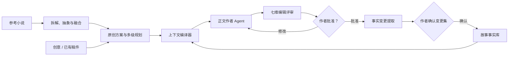
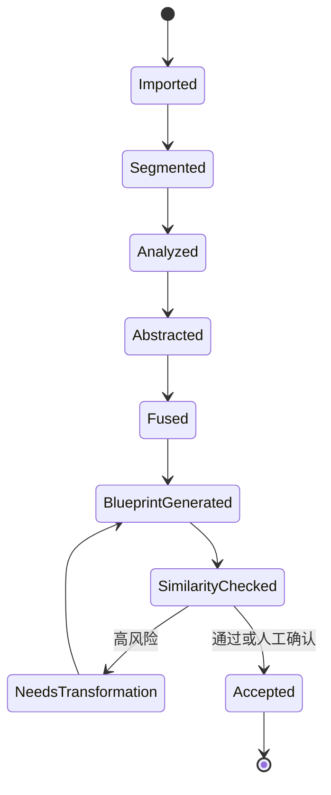
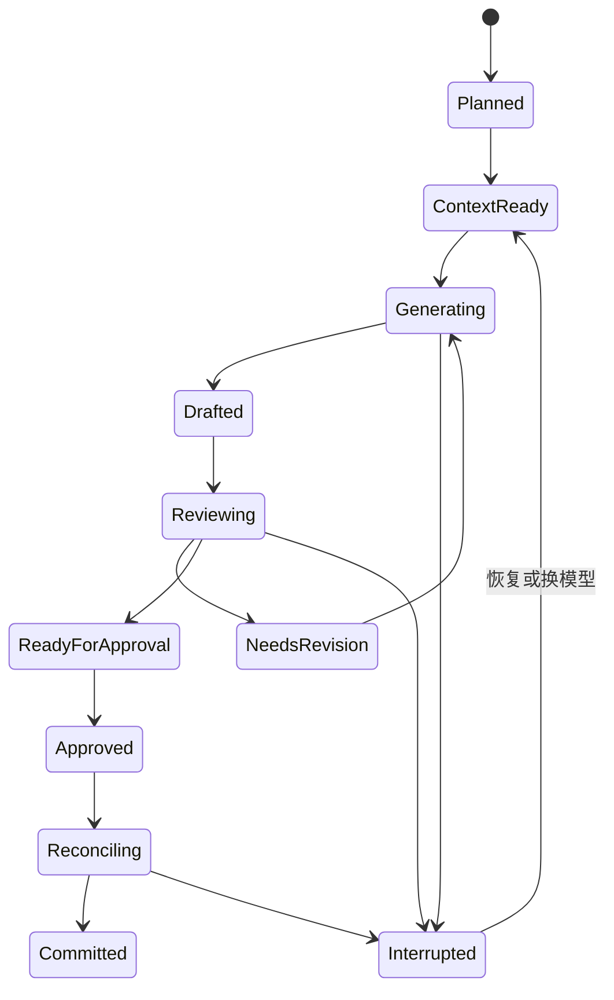

# 中文小说工作台 PRD

> 暂定名：墨舟（工作名）  
> 文档版本：v0.6  
> 日期：2026-08-09  
> 状态：已批准实施（PLAN M0）

## 1. 文档假设

1. 首要用户是持续更新中文男频网文的个人作者；首发重点题材为历史重生和都市重生，传统类型小说与文学小说作为后续扩展方向。
2. 产品首先以本地优先的 macOS/Windows 桌面工作台交付，单用户、单机使用。
3. AI 是作者可指挥、可审查的创作团队，不替代作者做不可逆的自动决定。
4. 用户自带模型密钥（BYOK），首版支持 OpenAI-compatible 接口，随后扩展 Claude、Gemini、Ollama 等原生适配。
5. 正文、设定和密钥默认保存在本地；未经用户主动操作，不上传到产品自有服务器。
6. 第一版采用自有实现，借鉴开源产品的通用能力设计，不直接复制许可证不明确或不适合闭源商业化的代码、提示词和资产。
7. MVP 不包含多人协作、订阅支付、平台直发、封面生成、有声书和营销工具。
8. 产品默认采用“近章细化、远章留白”的滚动规划，不要求作者开书前锁死整本大纲。
9. 现实资料是创作锚点而非自动真理；史实、现实资料、作者设定和沙盘推演结果必须分层存储并显示来源。
10. 用户可以导入自己创作、获得授权或合法取得的参考小说进行私人拆解；参考原文、抽象模式和新作事实分层存储，正文生成默认只使用抽象模式，不把参考作品直接当作续写素材。

## 2. Problem Statement

中文长篇作者使用通用聊天式 AI 创作时，面临五个持续性问题：

- 上下文随篇幅增长而失控，人物事实、时间线、称谓、知识边界和伏笔容易漂移。
- AI 会生成局部通顺但整体重复、缺乏推进、充满套话或“翻译腔”的正文。
- 书纲、卷纲、章纲、场景与正文分散在聊天记录和文件中，难以维护可追踪的创作状态。
- 生成、审校、修改和事实更新没有可靠闭环，重试或模型报错后容易丢失进度。
- 作者难以判断 AI 使用了哪些资料、修改了哪些事实、为何提出某项建议。

网文连载还增加了持续交付压力：作者需要每天稳定产出，在章节内完成推进和情绪兑现，以章尾悬念带动下一章，同时保留可调整的中长期方向。一次生成“整本大纲”或“整章正文”无法解决断更恢复、存稿管理、滚动改纲和连续多章节奏衰减。

历史重生和都市重生还要求系统同时维护“原始现实/历史时间线”和“主角介入后的小说时间线”，并管理主角知道哪些未来信息、这些信息是否可靠、哪些变化已经使原有经验失效。若缺少来源、分歧点和影响追踪，AI 很容易让主角无依据地全知、错误套用现代制度，或在历史已经改变后继续照搬原时间线。

作者虽然能够找到同题材成功作品，却通常只能凭感觉学习。直接让模型“照着某书写”又容易复制其独特表达、人物组合和场景顺序。产品需要把参考作品转换为可验证的结构分析与抽象创作模式，并在进入新作前完成多参考融合、选择性保留与重组、相似度检查。

用户需要的不是“输入一句、补写一段”的聊天壳，而是一个能够保存故事状态、组织创作流程、支持作者决策，并在几十万字尺度保持连续性的中文小说工作台。

## 3. Solution

构建一个本地优先的中文长篇小说工作台，将创作过程组织成可暂停、可恢复、可审查的章节生产闭环：

1. 作者从创意或已有稿件创建项目。
2. 资料研究员把作者导入的史料、新闻、行业资料、地理信息和个人笔记整理为带时间、来源与可信度的资料卡。
3. 拆书实验室把用户提供的参考小说分章、分场景，提炼故事发动机、卷章结构、钩子类型、兑现节奏、人物功能和情绪曲线；每项结论链接原章节供作者核验。
4. 模式融合器将多部参考作品的共同规律与差异转为抽象模式卡。作者可以跨书选择任意分析区段，分别把时代、核心欲望、冲突因果、资源体系、关键场景顺序和结局标为保留、调整或重构，并优先重新组合人物关系；系统依据最终组合而非固定“全部改变”规则执行原创性检查。参考原文默认不进入正文生成上下文。
5. 总导演协助形成目标读者、核心卖点、重生分歧点、长期承诺、人物弧、卷级方向和滚动章纲。
6. 双时间线模块区分原始时间线、小说时间线和主角未来知识，追踪每次介入造成的连锁变化。
7. 上下文编译器根据当前章节精准选择人物状态、世界规则、现实资料、时间线、伏笔、历史摘要和文风维度。
8. 正文作者 Agent 生成草稿或执行局部改写。
9. 编辑评审组从连续性、连载节奏、剧情推进、人物行为、现实锚点、中文文风和技术格式七个维度给出有证据的审校结果。
10. 作者逐项接受、拒绝或修改建议，并批准章节定稿。
11. 事实记录员从定稿章节提取事实变更，以变更集形式等待作者确认，再写入故事事实库。
12. 所有生成、修改、上下文和状态变更都有版本、来源和恢复点。

## 4. 产品目标

### 4.1 MVP 目标

- 让新用户在完成模型配置后 15 分钟内，从一句创意得到可编辑的故事方向、首章章纲和首段正文。
- 让作者维护未来 3–5 章的滚动章纲、当日写作目标与可发布存稿，而不是一次锁死整本细纲。
- 支持原始时间线、小说时间线、重生分歧点和主角未来知识账本，防止变化发生后仍机械照搬现实历史。
- 支持作者导入现实资料并形成可引用资料卡；AI 必须区分有来源事实、作者设定和推演假设。
- 支持参考小说的本地拆解，输出带来源的结构图、钩子卡、节奏图和人物功能矩阵，而不是长段复述原文。
- 参考驱动的新作方案在进入规划器前，必须通过短语、专名和关键情节节拍序列的最低原创性检查。
- 支持至少 30 万中文字符的项目，仍能按章节稳定检索与编辑。
- 每次章节生成都能说明使用了哪些设定、历史章节和文风资料。
- 章节任务在应用退出、模型超时或网络错误后可以从最近检查点恢复。
- 未经作者确认，不自动修改已批准正文或正式故事事实。
- 完成“规划—写作—审校—批准—回灌—下一章”的完整闭环。

### 4.2 成功指标

- 首章闭环完成率：新建项目用户中，至少 60% 完成首章草稿和一次审校。
- 首三章连续创作率：完成首章闭环的用户中，至少 40% 在七天内完成三个相互连续的批准章节。
- 连载节奏评测：固定测试集中，章节无有效状态变化、承诺未兑现或章尾悬念失效等问题的召回率达到 85%。
- 双时间线评测：固定重生测试集中，已失效未来知识、错误年代引用和分歧后因果冲突的召回率达到 90%。
- 资料可追踪性：100% 被写入“现实锚点”的资料具有来源、适用年代和作者确认状态。
- 拆解可追踪性：100% 的参考作品分析结论能够回到来源章节；进入生成上下文的模式卡不含长段原文。
- 原创性门禁：100% 由参考模式生成的新作方案经过短语、专名和关键节拍序列检查，高风险方案不得一键进入正文生成。
- 状态可靠性：所有自动化失败场景中，99% 可从检查点恢复且不丢失已批准正文。
- 连续性评测：在内部矛盾测试集中，明确事实冲突召回率达到 90%，误报率不高于 20%。
- 可追踪性：100% 的 AI 生成内容可查看模型、任务、提示模板版本和上下文来源。
- 性能：30 万中文字符项目冷启动不超过 3 秒；项目内搜索常规响应不超过 500 毫秒。
- 隐私：密钥不写入日志或项目导出包；默认无产品侧内容上传。

## 5. 用户与核心场景

### 5.1 目标用户

- **男频历史重生作者（核心）**：需要史实、制度、地理、技术条件、历史人物关系和改史后的连锁反应。
- **男频都市重生作者（核心）**：需要年代环境、行业变化、商业逻辑、城市生活和主角未来知识边界。
- **网文新作者（核心）**：需要从卖点、目标读者和前几章验证开始，逐步形成可持续连载的故事结构。
- **传统类型小说作者（后续）**：需要悬疑、幻想、科幻、言情等类型结构和规则一致性。
- **已有稿件作者**：希望导入草稿，建立故事事实库，获得结构与连续性审校。
- **AI 创作研究者**：希望查看上下文、Agent 运行过程、成本和质量评测结果。

### 5.2 核心使用场景

1. 从一句创意创建网文项目，确定目标读者、题材、核心卖点和更新目标。
2. 从已有 Markdown/TXT/DOCX 稿件恢复项目结构。
3. 维护人物、世界规则、时间线、伏笔和称谓。
4. 逐级生成和调整书纲、卷纲、章纲、场景节拍。
5. 生成、续写或局部重写正文，并锁定不得改变的事实。
6. 审核连续性、人物行为、剧情推进和中文文风。
7. 批准章节并将新事实回灌到下一章上下文。
8. 对比版本并导出 Markdown、DOCX 或 EPUB。
9. 维护未来 3–5 章的滚动章纲、每日目标和存稿状态。
10. 在断更或中断后，通过近期摘要、开放线索和下一章入口快速恢复创作。
11. 导入史料、年代资料、行业报告、新闻和个人笔记，并转换为可引用资料卡。
12. 在原始时间线与小说时间线之间查看重生分歧和连锁影响。
13. 对关键转折运行角色与势力沙盘，比较多种可能后果，但不自动写入正式事实。
14. 导入合法取得的同类小说，查看其故事发动机、开篇钩子、卷章结构、兑现节奏和人物功能。
15. 对比 2–5 部参考小说的共同规律与差异，为各模式选择保留、调整或重构，并在重新组合人物关系后生成新方案。
16. 在采用参考方案前查看来源和相似度报告，修改或放弃高风险设计。

## 6. User Stories

### 6.1 项目与导入

1. 作为新作者，我想从一句创意创建小说项目，以便快速开始而不必先填写大量表格。
2. 作为作者，我想选择题材、目标读者和连载强度，以便获得匹配的节奏与审校标准。
3. 作为已有稿件作者，我想导入 TXT、Markdown 或 DOCX，以便继续创作而不是重新录入。
4. 作为作者，我想把稿件自动拆分为卷、章和场景候选，以便快速恢复项目结构。
5. 作为作者，我想在导入后确认或修正自动识别结果，以免错误结构进入正式项目。
6. 作为作者，我想给项目设置目标字数、章节长度、更新频率和安全存稿量，以便规划连载进度。

### 6.2 故事定位与规划

7. 作为作者，我想让 AI 根据创意给出多套目标读者、核心卖点和故事方向，以便比较而不是被第一种答案锁定。
8. 作为作者，我想锁定主题、核心冲突、读者承诺和结局方向，以便后续 Agent 不随意漂移。
9. 作为作者，我想维护书纲、卷纲、章纲和场景节拍，以便从宏观结构下钻到正文。
10. 作为连载作者，我想为每章设置开篇钩子、阶段兑现和章尾悬念，以便控制阅读节奏。
11. 作为作者，我想查看人物弧与主线、支线的对应关系，以便发现长时间没有推进的线索。
12. 作为作者，我想手动编辑任何 AI 生成的规划内容，以便始终保持创作主导权。
13. 作为作者，我想锁定某些规划字段，以便重新生成时保留已经确认的决定。

### 6.3 故事事实库

14. 作为作者，我想维护人物卡、关系、称谓、能力、目标和当前状态，以便减少人物漂移。
15. 作为作者，我想维护地点、组织、物品、社会规则和世界运行规则，以便避免设定冲突。
16. 作为作者，我想维护绝对时间线和相对事件顺序，以便发现年龄、路程和日期矛盾。
17. 作为作者，我想记录伏笔的埋设、强化、误导和回收状态，以便避免遗忘。
18. 作为作者，我想标记每个角色当前知道和不知道的信息，以便防止人物越权知情。
19. 作为作者，我想看到每项事实的来源章节和确认状态，以便判断可信度。
20. 作为作者，我想将事实分为草案、候选和正式设定，以便未经确认的内容不污染后续写作。
21. 作为作者，我想发现人物名称、别名、称谓和代词混用，以便保持中文叙事清晰。

### 6.4 正文创作

22. 作为作者，我想基于章纲生成完整章节，以便快速获得可编辑初稿。
23. 作为作者，我想选中一段进行扩写、压缩、改写或改变情绪强度，以便局部迭代。
24. 作为作者，我想指定视角人物、时态、叙述距离和语气，以便保持叙事一致。
25. 作为作者，我想引用自己的文风样稿，以便生成结果更接近我的表达习惯。
26. 作为作者，我想设置禁用词、避免句式和偏好表达，以便抑制明显“AI味”。
27. 作为作者，我想锁定正文片段，以便批量修改时不会误改关键句。
28. 作为作者，我想看到生成前实际使用的上下文摘要，以便在消耗模型费用前检查。
29. 作为作者，我想控制单次生成字数和模型，以便平衡质量、速度与成本。
30. 作为作者，我想在模型失败后更换模型重试同一任务，以便不中断创作。

### 6.5 审校与修改

31. 作为作者，我想收到引用证据的连续性问题，以便快速定位冲突来源。
32. 作为作者，我想检查人物行为是否符合其目标、能力和已知信息，以便保持可信度。
33. 作为作者，我想检查章节是否推进冲突、关系或谜题，以便避免无效章节。
34. 作为作者，我想检测翻译腔、空泛抒情、重复总结、滥用转折和套话，以便改善中文质感。
35. 作为作者，我想检查标点、对话格式、错别字和称谓，以便完成基础技术审校。
36. 作为作者，我想逐条接受、拒绝或编辑修改建议，以便 AI 不直接覆盖正文。
37. 作为作者，我想比较修改前后文本及修改理由，以便判断修改是否值得保留。
38. 作为作者，我想重新运行单一审校维度，以便避免为无关检查重复付费。

### 6.6 批准、回灌与版本

39. 作为作者，我想明确批准章节版本，以便区分草稿和正式故事事实来源。
40. 作为作者，我想在批准后查看事实变更集，以便决定哪些内容进入正式事实库。
41. 作为作者，我想拒绝或修正错误的事实提取，以便不让模型误读污染后续上下文。
42. 作为作者，我想为章节建立快照并随时回滚，以便安全尝试不同版本。
43. 作为作者，我想查看某项设定何时被修改以及影响哪些章节，以便评估改动范围。
44. 作为作者，我想复制章节分支尝试另一种写法，以便比较而不破坏当前稿件。

### 6.7 模型、成本与运行状态

45. 作为作者，我想配置多个模型提供商，以便按任务选择更合适的模型。
46. 作为作者，我想按 Agent 指定默认模型，以便用不同模型完成规划、写作和审校。
47. 作为作者，我想查看每次任务的字符量、token、耗时和估算费用，以便控制成本。
48. 作为作者，我想暂停、取消和恢复长任务，以便掌控资源消耗。
49. 作为作者，我想看到任务目前处于哪个阶段，以便判断是否需要人工处理。
50. 作为作者，我想导出运行日志但自动移除密钥和敏感配置，以便安全排查问题。

### 6.8 导出、隐私与可靠性

51. 作为作者，我想导出 Markdown、DOCX 和 EPUB，以便投稿、备份和发布。
52. 作为作者，我想只导出正文或同时导出设定资料，以便适配不同用途。
53. 作为作者，我想自动备份项目并验证备份可恢复，以便防止长期创作成果丢失。
54. 作为作者，我想将 API 密钥保存在系统安全存储中，以便避免明文泄露。
55. 作为作者，我想在完全离线模式使用本地模型，以便敏感稿件不离开设备。
56. 作为作者，我想查看哪些任务会访问外部模型，以便在调用前做出知情决定。

### 6.9 连载管理

57. 作为网文作者，我想查看今日目标、已写字数和连续更新记录，以便安排每日产出。
58. 作为网文作者，我想区分草稿、待审、已批准和可发布章节，以便管理存稿。
59. 作为网文作者，我想维护未来 3–5 章的滚动细纲，以便保持方向又能根据读者反馈调整。
60. 作为网文作者，我想检查每章是否产生有效状态变化和情绪回报，以便避免“写了但没推进”。
61. 作为网文作者，我想看到连续三章的承诺、升级、兑现和悬念分布，以便避免节奏机械重复或长期不兑现。
62. 作为中断更新的作者，我想得到一份“上次写到哪里、哪些线未收、下一章从哪里起”的恢复卡，以便快速复更。

### 6.10 重生题材与现实资料

63. 作为历史重生作者，我想建立重生年代、地点和关键历史节点，以便确定故事的现实基线。
64. 作为都市重生作者，我想维护当时的行业、技术、消费、城市和社会环境资料，以便避免使用尚未出现的事物。
65. 作为作者，我想给资料卡记录来源、发布日期、适用年代、摘录和可信度，以便判断是否可以作为正文依据。
66. 作为作者，我想明确区分史实、现实资料、作者架空设定和 AI 推演假设，以便读者能够相信故事世界的内部逻辑。
67. 作为作者，我想同时查看原始时间线和小说时间线，以便知道主角的介入改变了哪些事件。
68. 作为作者，我想维护主角的未来知识账本，包括记忆内容、置信度和失效状态，以便防止主角无依据全知。
69. 作为作者，我想在重大分歧后自动标记可能失效的未来知识，以便重新评估后续章纲。
70. 作为作者，我想模拟关键人物、家族、官府、企业或公众对一个变化的反应，以便发现更可信的剧情后果。
71. 作为作者，我想将沙盘结果作为候选剧情分支进行比较，以便获得灵感但不污染正式时间线。

### 6.11 拆书、模式融合与原创性防护

72. 作为作者，我想导入自己创作、获得授权或合法取得的 TXT、Markdown、PDF 参考小说，以便在本地分析同题材作品。
73. 作为作者，我想让系统自动识别卷、章、场景和视角切换，以便建立可核验的作品结构图。
74. 作为作者，我想查看故事发动机、核心欲望、阻力升级、转折和阶段兑现，以便理解故事为什么能够持续推进。
75. 作为网文作者，我想查看前三章钩子、章尾悬念、承诺—升级—兑现节奏和情绪曲线，以便学习留存机制。
76. 作为作者，我想把具体人名和情节抽象为人物功能、冲突机制和钩子类型，以便学习结构而不是复制表达。
77. 作为作者，我想让每条分析结论链接到参考作品的来源章节，以便判断 AI 是否误读。
78. 作为作者，我想对比 2–5 部作品的相同模式和差异，以便避免单一来源的一对一映射。
79. 作为作者，我想分别决定保留、调整或重构时代、核心欲望、冲突因果、资源体系、关键场景顺序和结局，并优先重新组合人物关系，以便既保留有效灵感又形成独立方案。
80. 作为作者，我想在方案进入规划器前检查长短语、专有名词、人物组合、关键节拍序列及多维度组合相似度，以便发现“单项常见但组合过近”的仿写风险。
81. 作为作者，我想让高风险结果只能修改、重新生成或人工确认，不能直接进入正文 Agent，以便保留原创性门禁。
82. 作为作者，我想删除参考原文及其索引，并选择是否保留已经抽象化的模式卡，以便控制私人素材。

## 7. 功能范围与优先级

| 模块 | P0 MVP | P1 | P2 |
|---|---|---|---|
| 项目、卷章树、编辑器 | 创建、编辑、自动保存、连载看板 | 分支、批量操作 | 多窗口 |
| 导入 | TXT、Markdown、PDF | DOCX、网页资料卡 | Scrivener 等格式 |
| 规划 | 卖点、卷级方向、滚动章纲、场景、钩子与兑现 | 题材模板、节奏曲线 | 可视化关系图 |
| 故事事实库 | 人物、世界、双时间线、未来知识、伏笔、来源 | 知识边界、影响分析 | 系列级共享设定 |
| 现实资料 | 本地资料卡、年代、来源、可信度、事实分层 | 网页采集与来源更新 | 共享题材资料包 |
| 拆书实验室 | 本地导入、分章分场景、结构/钩子/节奏/人物功能分析、结论回链 | 多作品对比、模式融合、文风维度分析 | 合法授权的题材基准库 |
| 原创性防护 | 记录各维度的保留/调整/重构选择；检查长短语、专名、人物组合、关键节拍序列和组合风险；高风险阻断 | 场景级语义相似度、可配置阈值 | 作者私有基准库与趋势报告 |
| Agent | 资料研究、导演、作者、连续性、连载节奏、文风、记录员 | 人物与题材编辑、剧情沙盘 | 自定义 Agent 市场 |
| 上下文 | 结构化事实、现实锚点、摘要、关键词检索 | 向量召回、预算优化 | 自适应召回策略 |
| 审校 | 七维问题列表、证据、建议、三章节奏窗口 | 多评审合议、评分趋势 | 作者偏好学习 |
| 运行可靠性 | 检查点、恢复、取消、重试 | 批量章节队列 | 后台定时任务 |
| 模型 | OpenAI-compatible | Claude、Gemini、Ollama | 自动路由与预算策略 |
| 版本与导出 | 快照、差异、Markdown | DOCX、EPUB、平台格式预设 | 排版主题、PDF |

## 8. 核心交互

### 8.1 主工作台

- 左侧：项目、卷、章、场景树，以及故事事实库入口。
- 中间：沉浸式中文正文编辑器，支持锁定片段、版本比较和行内建议。
- 右侧：AI 工作台，显示任务目标、上下文来源、运行进度、审校问题和事实变更集。
- 顶部：今日目标、当前章节状态、存稿量、字数、模型、费用和恢复点。
- 连载看板：未来 3–5 章滚动章纲、开放承诺、待兑现事项和可发布章节队列。
- 重生看板：原始时间线、小说时间线、当前分歧点、已失效未来知识和待核实现实资料。
- 拆书实验室：左侧为参考作品与章节，中间为结构/节奏/钩子视图，右侧为来源证据、模式卡、多书对比和原创性报告。

### 8.2 参考作品生命周期

参考作品的具体剧情图和短证据只留在分析层；只有抽象模式卡与通过门禁的新作方案可以进入叙事规划器。

### 8.3 章节生命周期

任何状态转换都写入事件日志。`Approved` 只代表正文被批准；必须经过事实变更确认后才能进入 `Committed`。

## 9. Implementation Decisions

### 9.1 深模块划分

1. **项目仓库（Project Repository）**  
   负责项目元数据、卷章结构、正文、附件、快照、备份和迁移，对上层暴露稳定的读写与事务接口。

2. **故事事实库（Canon Store）**  
   统一管理实体、关系、时间线、角色知识、伏笔和规则；每项事实带状态、来源、有效期和冲突信息。它是正式事实的唯一来源，不由 RAG 结果替代。

3. **现实资料库（Reality Source Library）**  
   管理史料、新闻、行业报告、网页摘录和作者笔记。资料卡包含来源、日期、适用年代、摘录、可信度和确认状态；资料库只提供现实锚点，不自动写成故事事实。

4. **双时间线与未来知识账本（Counterfactual Timeline）**  
   并行维护原始时间线和小说时间线，记录重生点、分歧事件、影响范围和仍然有效的未来知识。重大分歧发生后，系统生成“可能失效”候选，不自动判定历史必然结果。

5. **叙事规划器（Narrative Planner）**  
   管理目标读者、核心卖点、长期承诺、卷级方向、滚动章纲和场景节拍之间的父子关系、锁定字段和变更影响。近 3–5 章可细化，远期只保留可调整方向。

6. **上下文编译器（Context Compiler）**  
   输入章节任务与 token 预算，输出有来源、按优先级排序的上下文包。上下文由硬约束、参与人物、相关规则、开放线索、历史摘要、检索片段和文风样稿组成。

7. **Agent Runtime 与章节状态机**  
   以持久化事件驱动章节任务，支持暂停、取消、重试、换模型和断点恢复。每个步骤必须幂等；重复执行不得覆盖已批准内容。

8. **模型网关（Provider Gateway）**  
   用统一任务接口屏蔽提供商差异，负责流式输出、超时、取消、重试、速率限制、使用量和错误归一化。模型能力与密钥配置分离。

9. **编辑评审引擎（Review Engine）**  
   将连续性、连载节奏、人物、剧情、现实锚点、中文文风和格式审校统一为结构化问题：严重级别、证据、解释、建议和置信度。连载节奏同时检查单章与连续三章的承诺、升级、兑现和悬念分布；现实锚点检查年代、来源和已失效未来知识；确定性规则与 LLM 审校并存。

10. **变更集与批准门（Change Set）**  
   正文修改和事实回灌都先形成可查看的差异，只有作者批准后才写入正式版本。拒绝与人工修改同样被记录。

11. **事实提取器（Chronicler）**  
   从已批准正文中提取候选人物状态、事件、关系、伏笔和世界事实；不得绕过变更集直接写正式事实库。

12. **剧情沙盘（Narrative Sandbox，P1）**  
    从正式事实、双时间线和现实资料创建不可变快照，允许 5–20 个关键角色或势力在限定规则下进行 3–10 轮推演。输出只进入候选剧情分支，必须经过作者选择；不直接复用 MiroFish 源码、Twitter/Reddit 动作模型或 Zep Cloud 依赖。

13. **导出器（Exporter）**  
    根据卷章顺序和导出配置生成 Markdown、DOCX、EPUB；导出是只读过程，不修改项目状态。

14. **参考作品拆解与原创性门禁（Reference Deconstruction & Originality Guard）**  
    以隔离语料库保存参考作品，建立卷—章—场景结构与来源证据；将具体剧情分析抽象为故事发动机、人物功能、冲突机制、钩子和节奏模式。作者可为时代、核心欲望、冲突因果、资源体系、关键场景顺序和结局选择保留、调整或重构，人物关系默认建议重组。系统针对最终选择检查短语、专名、人物组合、关键节拍序列和多维度组合风险，不以“所有维度必须改变”作为机械门槛。风险结果只能修改、重生成或人工确认；P1 再增加场景级语义相似度。

### 9.2 数据与记忆策略

- 正式事实使用结构化存储，原文是最终证据，摘要和向量只是检索加速层。
- 上下文采用四层记忆：本章硬约束、结构化事实、历史摘要、按需检索原文。
- 所有事实必须包含来源；没有来源的模型推断只能成为候选事实。
- 事实允许带有效时间范围，支持“过去为真、现在已变化”的人物状态。
- 文风资料与故事事实分离，避免修辞偏好被误当成世界设定。
- 现实资料、原始时间线、小说事实和沙盘假设使用不同类型，不允许在检索阶段合并为无来源文本。
- 主角未来知识具有来源、置信度和有效状态；小说时间线改变后，只能标记为候选失效，由作者确认。
- `ReferenceEvidence`、`AbstractPattern`、`GeneratedBlueprint`、`SimilarityFinding` 与 `CanonFact` 是不同数据类型；参考作品分析不得进入正式故事事实库。
- 参考原文默认只供拆解和来源核验；生成上下文使用作者选中的抽象模式卡，不默认携带原文段落。

### 9.3 技术栈基线

- 桌面壳：Tauri 2.x，首版支持 macOS 与 Windows。
- 前端：React 19.2、TypeScript 5.x、Vite。
- 本地服务：Python 3.14、FastAPI；以受控 sidecar 方式运行。
- 数据：SQLite + 迁移工具；正文与附件保留为可读本地文件，数据库保存索引与结构化状态。
- 检索：统一 Retrieval 接口；P0 使用关键词和元数据召回，P1 在兼容性验证后接入本地向量索引。
- 密钥：系统钥匙串/凭据管理器；项目文件和日志禁止保存明文密钥。
- 打包：桌面安装包内包含受支持运行时，用户无需单独安装 Python 或 Node.js。

### 9.4 非功能决策

- 本地优先，不依赖产品自有云服务才能写作。
- 自动保存采用原子写入和版本快照，避免半写入损坏项目。
- AI 输出一律视为不可信输入，结构化结果必须通过 schema 校验。
- 导入稿件中的指令性文本不得改变系统权限、工具范围或密钥访问。
- UI 必须允许纯键盘完成章节选择、编辑、生成、接受建议和保存。

## 10. Testing Decisions

### 10.1 测试原则

- 测试外部可见行为和稳定接口，不锁定内部实现细节或完整提示词文本。
- 确定性逻辑使用普通自动化测试；生成质量使用固定样例、规则指标和人工抽检组合。
- 所有真实模型测试显式标记，默认测试套件使用可重放的假模型，避免成本和随机性。
- 任何数据迁移、状态恢复或导出失败都视为阻断发布的问题。

### 10.2 必测模块

- 故事事实库：事实版本、时间有效性、来源、冲突和候选转正式流程。
- 上下文编译器：预算、优先级、参与人物过滤、来源追踪和确定性排序。
- 章节状态机：正常闭环、暂停、取消、超时、换模型、重复恢复和幂等。
- 模型网关：流式输出、错误归一、取消、超时、速率限制和用量记录。
- 评审引擎：结构化 schema、证据引用、重复问题合并和严重级别排序。
- 连载规划与节奏：滚动窗口、锁定范围、章节状态变化、情绪兑现和三章节奏分布。
- 现实资料与双时间线：来源、适用年代、分歧传播、未来知识失效和事实类型隔离。
- 拆书与原创性门禁：章节切分、来源回链、抽象层隔离、多作品融合、长短语/专名/人物组合/节拍序列检查和高风险阻断。
- 变更集：接受、拒绝、部分接受、人工修改、撤销和回滚。
- 项目仓库：原子保存、崩溃恢复、备份、迁移和损坏检测。
- 导出器：章节顺序、中文标点、标题层级、编码和可打开性。

### 10.3 测试层级

- 单元测试：纯规则、状态转换、预算计算、结构校验和文本差异。
- 契约测试：所有模型提供商适配器必须通过同一行为套件。
- 集成测试：项目仓库、状态机、上下文、假模型和事实回灌的完整章节闭环。
- 端到端测试：创建项目、生成章纲、生成正文、审校、批准、回灌、重启恢复和导出。
- 中文质量评测：事实矛盾、称谓、人物知识泄漏、年代错置、双时间线、未来知识失效、重复套话、对话标点、有效状态变化、情绪兑现和章尾钩子测试集。
- 拆书评测：只使用作者自有、明确授权、公版或合成语料，验证结构抽取准确度、模式卡不含长段原文，以及刻意近似方案能够触发门禁。
- 桌面兼容测试：受支持的 macOS 与 Windows 安装、升级、卸载和数据保留。

## 11. 安全、隐私与许可证

- API 密钥只进入系统安全存储和模型请求内存，不写日志、项目或导出文件。
- 网络请求只允许访问用户配置的模型端点；新增域名需要显式配置。
- 导入文件限制大小和类型，解析在低权限进程中完成，禁止执行嵌入脚本或宏。
- 日志默认脱敏，诊断包导出前再次扫描密钥和正文内容。
- 参考项目实行许可证清单与来源记录。Apache-2.0/MIT 代码如被采用，保留版权与许可证声明。
- AGPL 或需要商业授权的代码不进入闭源产品主干；无明确许可证的仓库只用于理解通用产品能力，不复制实现与提示词。
- 导入参考小说前要求用户确认来源与使用权；产品不提供破解 DRM、绕过付费、批量抓取或共享版权作品的能力。
- 参考原文默认本地保存且不用于产品训练。调用外部模型前显示将离开设备的具体片段，允许切换本地模型或取消；删除时同时清理派生索引。
- 按中国现行著作权规则，文字作品的独创性表达受保护，改编权属于著作权人；产品因此将“抽象规律学习”和“具体表达复用”分开，并将近似输出设为风险项。该设计是产品风险控制，不替代个案法律意见。参见[《中华人民共和国著作权法》](https://www.npc.gov.cn/c2/c30834/202011/t20201119_308796.html)。
- 如未来向中国境内公众提供生成式 AI 服务，还需在上线形态下评估知识产权、训练数据来源和用户输入保护义务。参见[《生成式人工智能服务管理暂行办法》](https://www.cac.gov.cn/2023-07/13/c_1690898327029107.htm)。

## 12. Out of Scope

- 多人实时协作、云同步和团队权限。
- 订阅、支付、用量计费和商业账号体系。
- 自动发布到起点、晋江、番茄等第三方平台。
- 自动把网络资料、历史争议或沙盘结果判定为唯一真实结论。
- 封面、插画、漫画、短剧、有声书和营销文案生产。
- 模型训练、微调和托管推理服务。
- 完全无人值守地批量生成整本小说并自动发布。
- 指定“照着某一本书写”、复刻在世作者个人风格、还原参考作品正文或人物关系，以及绕过原创性门禁。
- 破解 DRM、绕过付费、抓取或分发用户无权使用的小说全文。
- 移动端原生应用。
- 项目间共享商业素材库或在线 Agent 市场。

## 13. 发布门槛

MVP 只有在以下条件全部满足后才能进入公开测试：

- 完整章节闭环通过端到端测试。
- 模型超时、应用退出和系统重启后可恢复任务。
- 30 万中文字符压力项目满足性能目标。
- 备份恢复演练通过，已批准正文零丢失。
- 密钥与日志安全审查通过。
- 连续性评测达到既定召回率和误报率目标。
- 固定网文项目连续完成 10 章闭环，滚动章纲、开放承诺和正式事实均能正确推进。
- 历史重生与都市重生固定项目均能识别年代错置、双时间线冲突和已失效未来知识。
- 使用合成与合法测试语料验证参考分析可回链、原文与模式分层；近似短语、专名、人物组合和关键节拍序列高风险样例全部被阻断。
- macOS 与 Windows 安装包完成签名、安装、升级和卸载测试。
- 第三方依赖和参考来源完成许可证审查。

## 14. Open Questions

以下问题不阻塞 PRD 评审，但必须在相应开发阶段前确认：

1. 历史重生首批模板使用真实历史、半架空历史，还是两者都支持。
2. 都市重生首批重点覆盖 1990 年代、2000 年代还是 2010 年代。
3. MVP 是否必须包含 DOCX，还是 Markdown 导出即可进入首轮内测。
4. 是否需要首发 Ollama 离线模型；这会增加模型能力探测与安装支持成本。
5. 项目正文采用数据库主存储还是可读文件主存储；推荐后者，但需通过性能验证。
6. P1 向量检索的实现选择，需要经过中文召回质量、打包体积和跨平台兼容性试验。
7. 产品最终是个人开源工具、闭源商业桌面软件，还是云服务；许可证和账号体系会随之变化。
8. MVP 的单部参考作品容量、同时对比数量和导入格式上限；建议先支持 TXT、Markdown、PDF，EPUB 与 DOCX 放入 P1。
9. 原创性门禁的默认阈值与人工确认权限，需要通过编辑评审和合成对抗样例校准，不能只依赖单一相似度分数。

## 15. 参考能力来源

- [AI-Novel-Writing-Assistant](https://github.com/ExplosiveCoderflome/AI-Novel-Writing-Assistant)：中文长篇工作流、检查点和状态回灌思路；默认 AGPL-3.0，并有商业授权条款。
- [creative-writing-skills](https://github.com/haowjy/creative-writing-skills)：多角色编辑部、风格资料和故事知识库思路；Apache-2.0。
- [AuthorAgent](https://github.com/Ckokoski/AuthorAgent)：本地优先、长篇记忆、多模型和导出思路；MIT。
- [autonovel](https://github.com/NousResearch/autonovel)：迭代评审和完整生产流水线思路；当前未见明确许可证。
- [NovelWriter](https://github.com/EdwardAThomson/NovelWriter)：多级审校和长篇样例思路；当前未见明确许可证。
- [howells/fiction](https://github.com/howells/fiction)：面向 Codex/Claude 的专业角色与大稿件工作流思路；当前未见明确许可证。
- [MiroFish](https://github.com/666ghj/MiroFish)：图谱、人设、群体推演、变量注入、角色采访和报告 Agent 思路；AGPL-3.0，仅作为 P1 剧情沙盘的能力参考，不直接合并源码。
